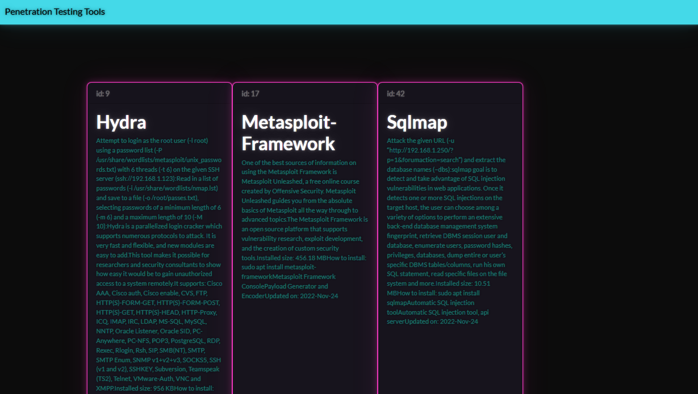

# magic-cookie
  Compile description of kali linux tools with web scraper, but... what is magic cookie? and why?



#### how to
How use scraper:
```
	gem install nokogiri
	gem install httparty
	ruby ./scraper_kali-tools.rb
```

How use frontend:
```bash
	cd frontend;
	npm install # or yarn if you have 'memory cache'
	npm run dev # yarn dev

	# url: http://localhost:3000
```
